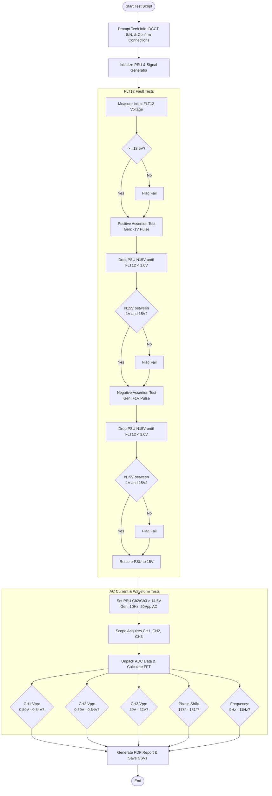

# ALSu_DCCT_Testing

This repository contains an automated Python-based testing suite for ALSu DCCT (Direct Current Current Transformer) Modules. This suite controls various lab instruments via PyVISA to perform rigorous fault and current tests, analyzes the acquired waveforms, and automatically generates comprehensive PDF test reports.

## Features

* **FLT12 Fault Testing:** Tests the FLT12 fault output status (an open emitter output) by decrementing the -15V supply in 250mV steps and measuring the voltage to verify assertion and de-assertion thresholds.
* **AC Current Testing:** Drives an AC signal into a Kepco supply to push current through the DCCT. It verifies that Channel 1 and Channel 3 are matched in phase, Channel 2 is 180 degrees out of phase, and output signals meet valid amplitude levels.
* **Waveform Analysis:** Unpacks ADC waveform data from the oscilloscope and calculates frequency and phase shift using Fast Fourier Transform (FFT).
* **Automated PDF Reporting:** Generates a complete PDF report with ReportLab, detailing pass/fail statuses, technician demographics, and embedded waveform plots.
* **Modular Instrument Control:** Uses PyVISA utilities to connect to and control instruments via USB or Ethernet/IP connections.

## Hardware Requirements

The testing suite is designed to interface with the following lab equipment:
* **Power Supply:** Rigol DP800 Series (e.g., DP832, DP831, DP822, DP811).
* **Signal Generator:** Rigol DG4000 Series.
* **Oscilloscope:** Tektronix DPO4000 or MSO4000 Series.
* **Digital Multimeter (DMM):** Keysight 34461A or Keithley 2100 Series.
* **Additional PSU:** Kepco Power Supply (driven by the signal generator for AC current testing).
* **Other Equipment:** Other equipment may be substituted by creating a new instrument library using identical commands to others in the library, for ease of compatibility. See, for example, switching between the Keysight 34461A vs Keithley 2100 DMMs  seamlessly by changing only the address and the DMM object instantiation.

## Software Requirements

* Python 3.x
* Dependencies listed in `requirements.txt`:
    * `PyVISA==1.14.1`
    * `reportlab==4.3.1`
    * `matplotlib==3.10.1`
    * `numpy==2.2.4`
    * *(See `requirements.txt` for the full list of required packages)*

## Repository Structure

The project is organized into modular scripts separating instrument drivers, testing logic, and data reporting:

```text
ALSu_DCCT_Testing/
├── main.py                     # Main execution script and orchestrator
├── plotter_calculator.py       # Waveform unpacking, math (FFT), and matplotlib plotting
├── report_generator.py         # PDF generation using ReportLab
├── requirements.txt            # Python package dependencies
├── .gitignore                  # Git ignore rules
├── README.md                   # Project documentation
├── functional_tests/           # Test execution modules
│   ├── fault_test.py           # FLT12 Fault 1 and 2 test logic
│   └── current_test.py         # AC current waveform test logic
├── instrument_modules/         # PyVISA instrument drivers
│   ├── keithley_2100.py        # Keithley DMM driver
│   ├── keysight_34461a.py      # Keysight DMM driver
│   ├── rigol_dg4000.py         # Rigol Signal Gen driver
│   ├── rigol_dp800.py          # Rigol PSU driver
│   ├── Tek_DPO4000.py          # Tektronix Oscilloscope driver
│   └── visa_utils.py           # VISA connection utilities
└── Test_Data/                  # Dynamically generated root directory for test artifacts
    └── DCCT_<SN>-<Timestamp>/  # Unique test instance folder
        ├── DCCT_<SN>_Report.pdf # Final generated report
        └── raw_data/           # Subdirectory for raw test data
            ├── *.csv           # Technician info, raw channel data, fault data
            └── *.png           # Saved waveform plots
```

## Installation

1. Clone the repository:
   ```bash
   git clone [https://github.com/capotostobnl/ALSu_DCCT_Testing.git](https://github.com/capotostobnl/ALSu_DCCT_Testing.git)
   cd ALSu_DCCT_Testing
   ```
2. Create and activate a virtual environment (optional but recommended):
   ```bash
   python -m venv .venv
   source .venv/bin/activate  # On Windows use: .venv\Scripts\activate
   ```
3. Install the required Python packages:
   ```bash
   pip install -r requirements.txt
   ```

## Configuration

Before running the tests, ensure your instrument IP addresses and USB VISA resource strings are correctly configured at the top of `main.py`:

```python
# *************************************************************************
# ******Set Insturment IP Addresses******
PSU_IP_ADDRESS = "10.0.142.1"  # Set PSU IP Address here
SIG_GEN_IP_ADDRESS = "10.0.142.2"  # Set signal generator IP Address here
SCOPE_IP_ADDRESS = "10.0.142.3"  # Set oscope IP Address
# DMM_ADDRESS = "USB0::0x05E6::0x2100::8020357::INSTR"
DMM_ADDRESS = "10.0.143.23" # Set DMM Address here
# *************************************************************************
```

If needed, change object instantiation below the address settings, as well. 

```python
# *************************************************************************
# ******Create Instrument Objects******

psu = DP800(connection_method="IP", address=PSU_IP_ADDRESS)
gen = DG4000(connection_method="IP", address=SIG_GEN_IP_ADDRESS)
scope = DPO4000(connection_method="IP", address=SCOPE_IP_ADDRESS)
# dmm = Keithley2100(connection_method="USB", address=DMM_ADDRESS)
dmm = Keysight34461A(connection_method="IP", address=DMM_ADDRESS)
# *************************************************************************
```

## Testing Process Flow & Pass/Fail Parameters

The script follows a strictly defined sequence of initializations, fault threshold verifications, and AC waveform validations. Below is a flowchart detailing this process and the exact pass/fail parameters evaluated at each step.



## Usage

1. Power on all required instruments (Kepco PSU, Rigol PSU, DMM, Rigol function generator, and Tek Oscilloscope).
2. Ensure local network or USB connections to instruments are established.
3. Run the main testing script:
   ```bash
   python main.py
   ```
4. Follow the interactive prompts in the console to:
   * Enter your name and Life # (technician data).
   * Enter the DCCT Serial Number (scan barcode).
   * Confirm wiring connections via on-screen prompts (e.g., ensuring GRAY CT conductors go to GRAY terminal blocks, and BLUE conductors go to BLUE terminal blocks).
   * Confirm instrument setups (e.g., differential probes set to x20 Attenuation).
   * Refer to the 'George Ganetis' diagram, as needed, for reference. 
5. The script will automatically run the FLT12 Fault 1/Fault 2 tests, followed by the DCCT Current tests.
6. Upon completion, a PDF report will be generated and saved in the `Test_Data/DCCT_<SN>-<Timestamp>` directory, and will open automatically on your machine. Raw test data (`.csv` files) and waveform plots (`.png` files) are also saved in a `raw_data` subdirectory for archival purposes.